# EDA of all IMDB Listed Movies along with Oscars Information (2009-2018)

## Table of Contents
1. [Goal](#goal)
2. [Steps to run the code](#steps-to-run-the-code)
3. [Methodology](#methodology)
	+ [Data Selection](#a-data-selection)
	+ [Data Pre-processing](#b-data-pre-processing)
	+ [Data Transformation](#c-data-transformation)
	+ [Exploratory Data Analysis](#d-exploratory-data-analysis)
4. [Results And Evaluation](#results-and-evaluation)
	+ [Null and Zero Values](#a-null-and-zero-values)
	+ [Outliers](#b-outliers)
	+ [Descriptive Analysis](#c-descriptive-analysis)
	+ [Feature Engineering](#d-feature-engineering)
	+ [Parallel Boxplots](#e-parallel-boxplots)
	+ [Histogram](#f-histogram)
	+ [Pearson's Correlation](#g-pearsons-correlation)
	+ [Covariance](#h-covariance)
	+ [Pie Charts](#i-pie-charts)
	+ [Bar Charts](#j-bar-charts)
	+ [Line Graphs](#k-line-graphs)
	+ [Scatter Plots](#l-scatter-plots)
5. [Conclusion and Future Work](#conclusion-and-future-work)
	+ [Conclusions](#conclusions)
	+ [Future Work](#future-work)
6. [References](#references)

## Goal
Various study groups and institutions have 
conducted several studies on the criteria for success in the 
film business to date. According to one study, there are three 
factors by which a film's success can be measured. These are 
ratings given to a film by viewers and reviewers, as well as 
the picture's financial performance in its first few weeks and 
the number of awards it receives[1]. Using **ETL (*Extraction, Transformation and Loading*)** techniques, this project organized various sources of unstructured data into structured format inorder to analyze 
datasets on the film industry based on aforementioned criterion. To 
extract information from the data, the project also used **EDA (*Exploratory Data Analysis*)** techniques available. The main goal of this project 
can be summarized as follows:
+ **Understand the dataset**
+ **Establish relationships between attributes**
+ **Find out abnormalities in the data**

## Steps to run the code
<ul><b>1 -></b> Open <b>Anaconda Command Prompt</b></ul>
<ul><b>2 -></b> Goto Project folder</ul>
<ul><b>3 -></b> Run the command <b>"conda env create -f environment.yml"</b> to create conda environment</ul>
<ul><b>4 -></b> Run <b>"conda activate DAP"</b> to activate the environment</ul>
<ul><b>Note :<i></b> <b>MongoDB</b> and <b>PostgreSQL</b> should be already installed in the system to successfully run the code.</i></ul>


## Methodology
Data collecting is the most important element of data 
analysis. This section mentions different types of data sources 
used in the project and takes through the different steps of 
the methodology employed to prepare them for exploratory 
analysis. The steps discussed here are taken from the KDD 
methodology used for the project. The following is a detailed 
description of the steps:

### *A.* Data Selection
The data was selected from four different sources. The 
sources are detailed in the table below **(Table 1)**

| Name | Type | Format | Tables | Link |
| :---- | :----: | :----: | :----: | :----: |
| Movielens | CSV | Structured | 4 | [Link](https://movielens.org/) [2] |
| The Movie Database| API | JSON | NA | [Link](https://developers.themoviedb.org/3/movies/get-movie-details) [3] |
| The Rapid API | API | JSON | NA | [Link](https://rapidapi.com/rapidapi/api/movie-database-alternative/) [4] |
| Oscars| Website | Dictionary | NA | [Link](https://www.oscars.org/) [5] |

***Table 1 : Data Sources***

Details of the tables used from the ***MovieLens*** Dataset are 
mentioned in the table **(Table 2)** below:

| Name | Attributes| Description |
| :---- | :----: | :----: |
| movies.csv | movieId, title, genre | Most basic details of the movie |
| links.csv | movieId, imdbId, tmdbId| Standard Imdb id and Tmdb id mapped to the movieId |

***Table 2 : MovieLens CSV Tables***

### *B.* Data Pre-processing
Jupyter Notebook was used to write and run the code 
for the entire project, using conda as its package manager. 
The packages used in the project for ETL and EDA are listed below in **Table 3**

| Packages | Description |
| :---- | :----: |
| **Pandas** | Pandas is a popular data analysis tool used for all the ETL operations in the project|
| **Pymongo** | This python distribution was used to access MongoDB no-sql database from the jupyter notebook.|
| **Urllib3** | It is a popular python HTTP client required in the project for querying rest apis.|
| **Selenium** |It is a versatile automation tool mainly used for testing softwares, but was used in the project for scraping important information from *www.oscars.org* website.|
| **Psycopg2** | This is a PostgreSQL adapter used in the project for performing *CRUD* operations in PostgreSQL Database.|
| **Sqlalchemy** | This is a python ORM used in the project to map the dataframes to its corresponding relational tables in the sql database.|
| **Seaborn** | It is a data-visualization library used in the project for drawing plots.|
| **Matplotlib** | Similar to Seaborn this is also a data-visualization library. Infact Seaborn is based on Matplotlib.|

***Table 3:** List of Important Packages & their Description*

The conda environment containing the above mentioned packages were created from the *environment.yml* file by executing the following commands in *Conda prompt*:

```
• conda env create -f environment.yml
• conda env update -f environment.yml
• conda install ipykernel
• ipython kernel install --user --name=DAP
```

The final master dataset was obtained from all the four data sources following the ***ETL*** steps described below and illustrated in the **Figure 4**:

***Step 1 :*** \
The CSV files from the MovieLens dataset, was used to create a sorted list of 2000 movies released 
between 2009 to 2018. The data was sorted using the year 
value taken from the ***'title'*** column in the ***'movies.csv'*** file. 
Then, on the basis of ***'movieId'***, attribute, records from both the tables
***‘movies’*** and ***‘links’*** were merged to create a single collection. **Figure 1** below shows the
the merged list.  This combined table were then iteratively traversed to retrieve 
details from the APIs previously listed in **Table 1** using the corresponding 
external ids **(imdbid & tmdbid)**.

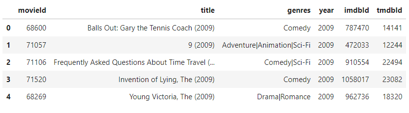

***Fig 1:** Dataframe showing the merged list*

***Step 2:***\
Both API responses have attributes that are both common 
and distinctive. Example of one such api response is provided below in **Figure 2**. They were both called to obtain detailed 
information about the films, and their responses were saved in 
**MongoDB** as **JSON** documents. In the data pipeline, 
MongoDB served as a good staging destination, allowing 
room to resume without having to contact the APIs again if 
data was corrupted during subsequent phases. The persistence 
of the data download state was another instance where 
MongoDB came through without any effort. One of the APIs 
has a daily limit of 1000 calls; thus, a JSON document was 
created to retain information about the latest state of the Http 
requests, which was then saved as a document in a separate 
collection titled 'State' in the MongoDB database.

```
{
  "_id": 68600,
  "Title": "Balls Out: Gary the Tennis Coach",
  "Year": "2009",
  "Rated": "R",
  "Released": "09 Apr 2009",
  "Runtime": "92 min",
  "Genre": "Comedy, Sport",
  "Director": "Danny Leiner",
  "Writer": "Andy Stock, Rick Stempson",
  "Actors": "Seann William Scott, Randy Quaid, Brando Eaton",
  "Plot": "A high school janitor has not recovered from his failed career as a tennis pro. He begins coaching his beloved sport to a group of misfits and leads them to the Nebraska State Championships.",
  "Language": "English",
  "Country": "United States",
  "Awards": "N/A",
  "Poster": "https://m.media-amazon.com/images/M/MV5BYmY3YmUxZDctMGE2MC00Nzk1LWFjOWMtYjM5ZTI0MTYyMjUxXkEyXkFqcGdeQXVyNTYyNDI4MzY@._V1_SX300.jpg",
  "Ratings": [
    {
      "Source": "Internet Movie Database",
      "Value": "5.5/10"
    }
  ],
  "Metascore": "N/A",
  "imdbRating": "5.5",
  "imdbVotes": "9,815",
  "imdbID": "tt0787470",
  "Type": "movie",
  "DVD": "13 Jan 2009",
  "BoxOffice": "N/A",
  "Production": "N/A",
  "Website": "N/A",
  "Response": "True"
}
```
***Fig 2:** Imdb API HTTP Response*

***Step 3:***\
The final source of data provides raw data on Oscar wins 
and nominations under the categories of "Best 
Picture", "Directing", "Acting," and "Writing" for the years 
spanning between 2002 and 2018. The website for Academy 
Awards was scraped using Selenium to obtain this 
information. Selenium is a GUI testing tool that can automate 
web page clicks and extract data from the HTML content. The 
scraped data was then converted to JSON and placed in a 
MongoDB database as documents. Example of one such JSON object is provided below in **Figure 3**.

```
{
  "_id": {
    "$oid": "6264b1c5dc3142ac111be7b2"
  },
  "year": "2002",
  "index": "(75th)",
  "directing": {
    "nominations": [
      {
        "movie": "Chicago",
        "director": "Rob Marshall"
      },
      {
        "movie": "Gangs of New York",
        "director": "Martin Scorsese"
      },
      {
        "movie": "The Hours",
        "director": "Stephen Daldry"
      },
      {
        "movie": "The Pianist",
        "director": "Roman Polanski"
      },
      {
        "movie": "Talk to Her",
        "director": "Pedro Almodóvar"
      }
    ],
    "winner": {
      "movie": "The Pianist",
      "director": "Roman Polanski"
    }
  },
  "acting": {
    "nominations": [
      {
        "movie": "The Pianist",
        "actor": "Adrien Brody"
      },
      {
        "movie": "Adaptation",
        "actor": "Nicolas Cage"
      },
      {
        "movie": "The Quiet American",
        "actor": "Michael Caine"
      },
      {
        "movie": "Gangs of New York",
        "actor": "Daniel Day-Lewis"
      },
      {
        "movie": "About Schmidt",
        "actor": "Jack Nicholson"
      }
    ],
    "winner": {
      "movie": "The Pianist",
      "actor": "Adrien Brody"
    }
  },
  "acting_female": {
    "nominations": [
      {
        "movie": "Frida",
        "actress": "Salma Hayek"
      },
      {
        "movie": "The Hours",
        "actress": "Nicole Kidman"
      },
      {
        "movie": "Unfaithful",
        "actress": "Diane Lane"
      },
      {
        "movie": "Far from Heaven",
        "actress": "Julianne Moore"
      },
      {
        "movie": "Chicago",
        "actress": "Renée Zellweger"
      }
    ],
    "winner": {
      "movie": "The Hours",
      "actress": "Nicole Kidman"
    }
  },
  "support_acting": {
    "nominations": [
      {
        "movie": "Adaptation",
        "actor": "Chris Cooper"
      },
      {
        "movie": "The Hours",
        "actor": "Ed Harris"
      },
      {
        "movie": "Road to Perdition",
        "actor": "Paul Newman"
      },
      {
        "movie": "Chicago",
        "actor": "John C. Reilly"
      },
      {
        "movie": "Catch Me If You Can",
        "actor": "Christopher Walken"
      }
    ],
    "winner": {
      "movie": "Adaptation",
      "actor": "Chris Cooper"
    }
  },
  "support_acting_female": {
    "nominations": [
      {
        "movie": "About Schmidt",
        "actress": "Kathy Bates"
      },
      {
        "movie": "The Hours",
        "actress": "Julianne Moore"
      },
      {
        "movie": "Chicago",
        "actress": "Queen Latifah"
      },
      {
        "movie": "Adaptation",
        "actress": "Meryl Streep"
      },
      {
        "movie": "Chicago",
        "actress": "Catherine Zeta-Jones"
      }
    ],
    "winner": {
      "movie": "Chicago",
      "actress": "Catherine Zeta-Jones"
    }
  },
  "best_picture": {
    "nominations": [
      {
        "movie": "Chicago"
      },
      {
        "movie": "Gangs of New York"
      },
      {
        "movie": "The Hours"
      },
      {
        "movie": "The Lord of the Rings: The Two Towers"
      },
      {
        "movie": "The Pianist"
      }
    ],
    "winner": {
      "movie": "Chicago"
    }
  },
  "writing_adapted": {
    "nominations": [
      {
        "movie": "About a Boy",
        "writer": "Screenplay by Peter Hedges and Chris Weitz & Paul Weitz"
      },
      {
        "movie": "Adaptation",
        "writer": "Screenplay by Charlie Kaufman and Donald Kaufman"
      },
      {
        "movie": "Chicago",
        "writer": "Screenplay by Bill Condon"
      },
      {
        "movie": "The Hours",
        "writer": "Screenplay by David Hare"
      },
      {
        "movie": "The Pianist",
        "writer": "Screenplay by Ronald Harwood"
      }
    ],
    "winner": {
      "movie": "The Pianist",
      "writer": "Screenplay by Ronald Harwood"
    }
  },
  "writing_original": {
    "nominations": [
      {
        "movie": "Far from Heaven",
        "writer": "Written by Todd Haynes"
      },
      {
        "movie": "Gangs of New York",
        "writer": "Screenplay by Jay Cocks and Steve Zaillian and Kenneth Lonergan; Story by Jay Cocks"
      },
      {
        "movie": "My Big Fat Greek Wedding",
        "writer": "Written by Nia Vardalos"
      },
      {
        "movie": "Talk to Her",
        "writer": "Written by Pedro Almodóvar"
      },
      {
        "movie": "Y Tu Mamá También",
        "writer": "Written by Carlos Cuarón and Alfonso Cuarón"
      }
    ],
    "winner": {
      "movie": "Talk to Her",
      "writer": "Written by Pedro Almodóvar"
    }
  }
}
```
***Fig 3:** Scraped Data from Oscars.org in JSON Format*

***Step 4:***\
ERDs (Entity Relationship Diagrams) were 
conceptualized to create tables in PostgreSQL with the data,
now available in MongoDB. By the end of this step, 6 SQL 
schemas and tables were created. These schemas are Movie, 
Director, Writer, Actor, Language, Genre, and 
Academy_awards. ‘Movie’ and ‘Academy_awards’ are the 
main tables whereas rest of them are multivalued attributes for 
‘Movie’.

***Step 5:***\
In the final step, following the creation of requisite SQL 
tables, the no-SQL documents were retrieved from the 
MongoDB database and transformed to corresponding Pandas
data frames as a preparatory stage before inserting data into 
the SQL database. The python package used for the purpose 
was 'sqlalchemy'. This Python library makes it easy to insert 
large amounts of data simultaneously into a PostgreSQL 
database. This is a quick operation for the project's 
relatively tiny amount of data (about 2k rows).


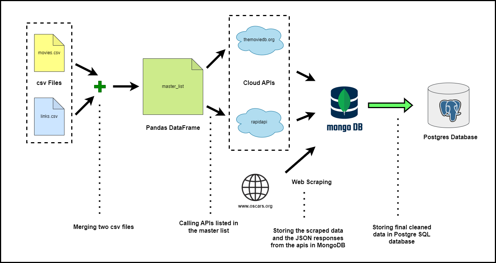
***Fig 4:** Data Extraction, Transformation & Loading Steps*

***Data Description:***\
Finally the following variables were included in the main table **‘Movie’** that was created after combining data from several sources.

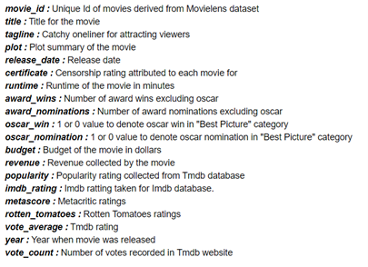

### *C.* Data Transformation
Outliers were initially detected and deleted in this step. In 
addition, null values were substituted with appropriate values. 
Finally, feature engineering was performed on the main data 
frame produced from the SQL table 'Movie' to include crucial 
features. Several multivalued properties, such as languages, 
genres, writers, directors, and productions, were maintained in 
their own relational tables in this database. The following 
dichotomous **(Table 4)** and continuous features **(Table 5)**
were created using the information from these multivalued 
attribute tables and the academy_awards:


| Name | Description |
| :---- | :----: |
| **oscar_nominated_director** | Indicates whether any of the directors has been nominated for an Academy Award.|
| **oscar_nominated_actor** | Indicates whether any of the actors has been nominated for an Academy Award |
| **oscar_nominated_actress** | Indicates whether any of the actresses has been nominated for an Academy Award. |
| **oscar_nominated_writer** | Indicates whether any of the writers has been nominated for an Academy Award.|

***Table 4 : New Categorical Features***


| Name | Description |
| :---- | :----: |
| **number_of_directors_in_a_movie** | The total number of directors engaged in a film|
| **number_of_writers_in_a_movie** | The total number of writers engaged in a film |
| **number_of_producers_in_a_movie** | The total number of producers engaged in a film |

***Table 5 : New Continuous Features***

As listed below (description of pandas data frames), new pandas data frames were created by 
merging information from multiple tables: 

+ Number of movies grouped by producers between 
2009-2018
+ Number of movies grouped by languages between 
2009-2018
+ Number of movies grouped by genres between 2009-
2018
+ Number of movies grouped by censor certificates 
between 2009-2018

### *D.* Exploratory Data Analysis
Exploratory data analysis (EDA) is a step in the data 
mining process in which an analyst does statistical and 
visual analysis on processed data to find patterns, 
loopholes, and information that would otherwise be 
hidden owing to its complexity and volume. The 
categories under which EDA is carried out in the project 
are listed below:

+ **Univariate Non Graphical :** Five Number Summary, 
Mean, Median, Mode, Standard deviation, skewness, 
kurtosis
+ **Univariate Graphical :** Boxplot, Histogram, Barchart,
+ **Multivariate Graphical**: Scatter plot, parallel boxplot,
pie charts


## Results And Evaluation
The dataset was subjected to a number cleaning, 
transformation and exploratory analyses in the order below:

### *A.* Null and Zero Values
The data didn't have many null values, as shown in the 
figure **(Fig 5)**. However, several columns, such as 'budget' 
and 'revenue,' contained numerous zero values that were 
substituted with the median value.

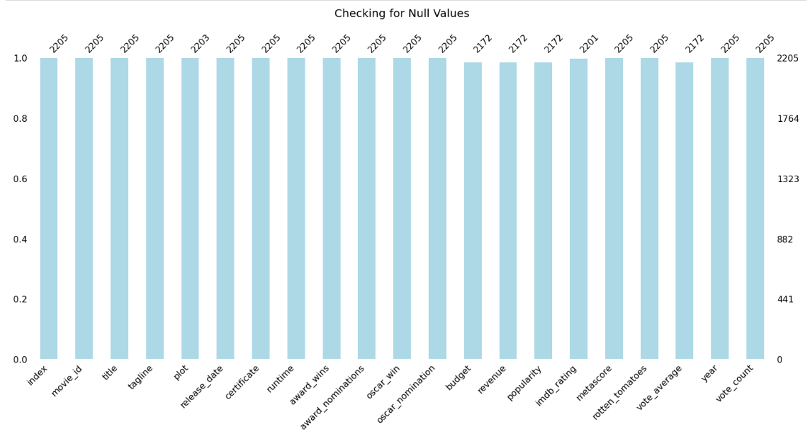
***Fig 5:** Plot displaying Null value count*

### *B.* Outliers
Boxplots of all continuous variables were generated, 
revealing many data outliers. Subsequently, the number of 
outliers for each of the variables was estimated using the IQR 
(Inter Quartile Range) formula. The number stood out to 
be extremely high, and therefore, in order to prevent 
a substantial amount of data loss, those were left untouched.

### *C.* Descriptive Analysis
The descriptive statistics of the pertinent variables were 
recorded after that using Five Number Summary and
calculating standard deviation around the mean, skewness 
and kurtosis. Those data are presented below:

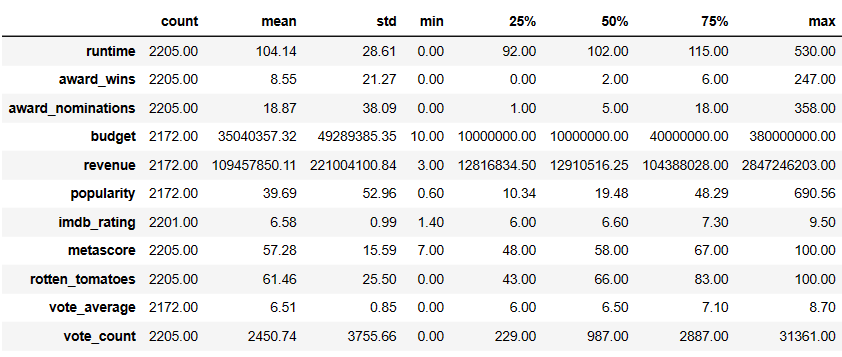
***Table 6: Descriptive Statistics***


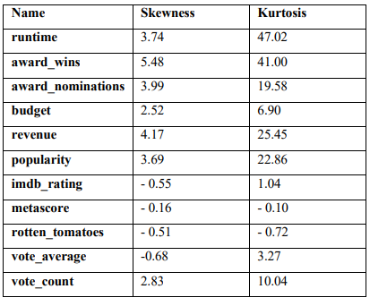

***Table 7:** Skewness & Kurtosis*

Each variable's skewness and kurtosis coefficient were 
also calculated as already shown above in the **Table 7**. The calculated result is 
consistent with earlier observations of outliers in boxplots and 
histograms. Almost every variable is heavily skewed to the 
right. Except for **'imdb_rating’**, **‘metascore'**, **'rotten tomatoes'**, and **'vote_average'**, all variables were found to be 
leptokurtic (> 3). Three of the above variables are 
platykurtic (3), and one is mesokurtic (3). These findings 
suggest a significantly asymmetrical distribution of values in 
the sample.

### *D.* Feature Engineering
As previously discussed in a data preprocessing phase, 
seven new features were built from existing data. These 
features make it possible to determine a film's commercial and 
critical success based on the number of Oscar-nominated crew 
members who appear in the film as an actor or a staff. 

### *E.* Parallel Boxplots
Using 'oscar_win' and 'oscar_nomination,' as 
factors two complementary boxplots for 'runtime' and 'award 
wins' were plotted. This produced few interesting details:
+ 95% of Oscar-nominated films have a running time 
of 1.5 to 2 hours approximately
+ All the Oscar-winning films were between 1.5 and 
2 hours long.
+ All the Oscar-winning films had previously won at 
least 100 awards in different categories at other 
events.
+ Almost 95% of all films, excluding Oscar 
nominees, have only garnered a total of 25 awards.

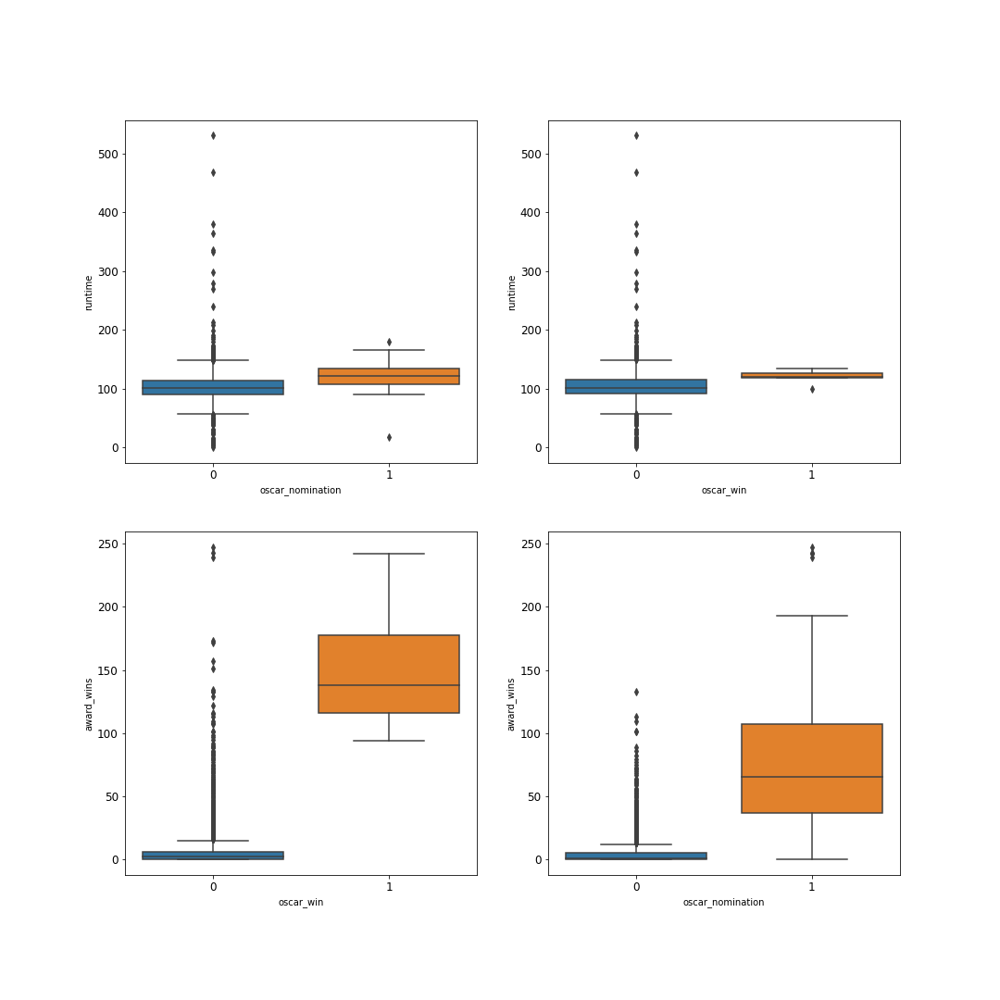
***Fig 6:** Parallel Boxplots*

### *F.* Histogram
The following details were revealed from histograms 
of the continuous variables as depicted in the **Figure 7**:

+ **runtime :** The majority of the films were 1 to 1.5 
hours long.
+ **award_wins :** Almost all of the films garnered fewer 
than 25 awards
+ **award_nominations :**  The majority of films receive 
25 to 50 nominations.
+ **budget :** 80% of films have a budget of less than $50 
million dollars.
+ **revenue :** Almost 90% of films grossed less than 
$250 million dollars.
+ **imdb_rating :** Although the data is skewed to the 
left, the majority of scores are between 5.5 and 8..
+ **metascore :** In Metacritic, nearly 35% to 45% of 
films receive a 60% rating.
+ **rotten_tomatoes :** The data is more dispersed here, 
with only about a quarter of the films scoring 60% to 
65%.
+ **vote_average :**  Again, this is in line with other online 
sites. For over 40% of the films, the Tmdb ratings are 
between 6 and 7.

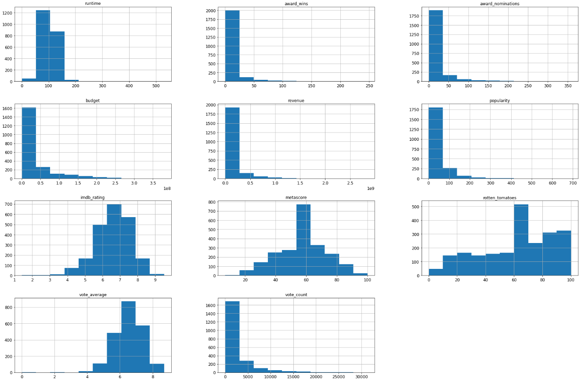
***Fig 7:** Histograms*

### *G.* Pearson's Correlation
For continuous variables, Pearson's correlation matrix was 
produced to measure the direction and strength of relationship 
between them. The results revealed that three variables, 
'revenue', 'budget', and 'popularity', had a substantial 
positive association with 'vote count'. The correlation 
between 'revenue' and 'popularity' is clear and obvious. The 
relationship between 'budget' and 'vote count' could indicate 
that audiences are more interested in higher-budget films. The
results can be viewed in **Fig 8**

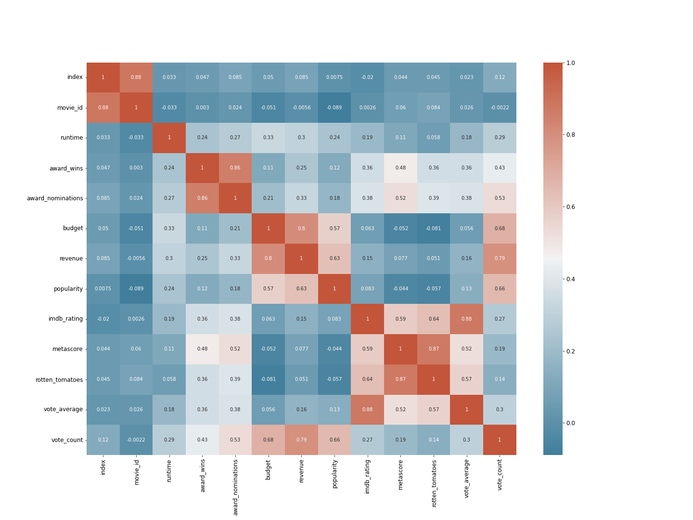
***Fig 8: Pearson’s Correlation Matrix***


### *H.* Covariance
The dataset's covariance matrix is produced, and the following 
odd negative covariances are discovered **(Table 8)**:

|Variables|metascore|rotten_tomatoes|oscar_win|budget|
|:----|:----:|:----:|:----:|:----:|
|metascore|243.14|--|--|--|
|rotten_tomatoes|347.64|650.12|--|--|
|oscar_win|0.1|0.1|0|--|
|budget|-40570344|-101968741|-42967|2.43e^15|

***Table 8 :** Covariances of pertinent variables*

### *I.* Pie Charts
Movie distribution by censor certificate:**(Fig 9)**
+ Almost two third of all films produced are labelled
as 'R' or 'PG-13'.
+ Around 39% of all films were rated 'R', while 26% 
were rated 'PG-13'. This indicates that 'R' and 'PG-13' rated films are the most popular 
categories among moviegoers.

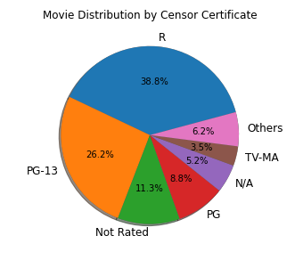

***Fig 9:** Pie Chart of distribution of films by certificate*


Movie distribution by Language **(Fig 10)**:
+ Nearly 64% of all the films were released in English.
+ Only 6 % movies were released in French which 
comes second
+ Other languages account for 21% of total releases.

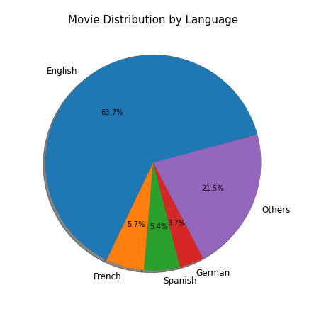

***Fig 10:** Pie Chart of distribution of films by language*


Movie distribution by Genre **(Fig 11)**:
+ 'Drama' is the most common genre found in most of 
the films. It was found in 13% of all the films that 
were released.

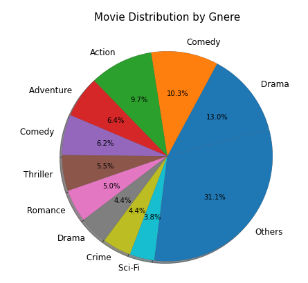

***Fig 11:** Pie chart of distribution of films by genre*


Movie distribution by Production Houses **(Fig 12)**:
+ The top 10 production companies made 10% of all 
films.
+ **'Universal Pictures'**, **'Warner Bros.'**, **'Columbia Pictures'**, and **'20th Century Fox'** are among the top 
10 producers, accounting for 5% of all films.

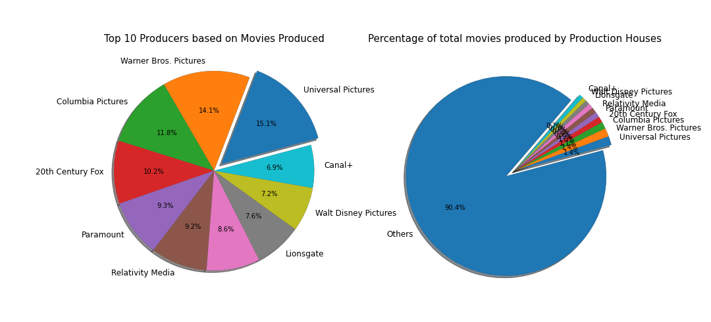
***Fig 12:** Pie chart of distribution of films by production houses*


### *J.* Bar Charts
Bar charts for all the categorical variables were plotted 
and the following observations were made:
+ Every year, with the exception of 2015, there has 
been a steady production of films.
+ Below 10% (< 200) films had at least one Oscar-nominated directors in the team
+ Almost 10% (= 200) films had at least one Oscar-nominated writer in the team
+ Slightly more than 10% (> 200) films had at least one 
Oscar nominated lead actor in the team.
+ Almost 5% (= 100) films had at least one oscar 
nominated lead actress
+ Almost 10% (= 200) movies had at least two 
directors in the team.
+ Almost 1/3rd of all movies had 1, 2 and 3 writers. In 
a film, the highest number of writers ever appeared 
happens to be around 20.
+ In a film, the highest number of producers ever 
involved happens to be around 21

Bar charts for all categorical variables against 
budget was plotted and following observations were 
recorded:
+ The average budget for films rated 'PG', 'PG-13', and 
'G' was the highest.
+ Films made in 2018 were more expensive than films 
made in previous years.
+ The cost of films directed by or starring Oscar 
nominated actors is approximately 100% more. It 
suggests that directors and actors who have been 
nominated for an Academy Award receive more pay.
+ Surprisingly, films starring Oscar nominated 
actresses had lower budgets.
+ Films with more than three directors cost around half 
as much as other films.
+ The most expensive films are those with 3 writers in 
the team.

Grouped Bar Chart displaying Number of films
produced factored by censor certificate and oscar win 
were plotted and following observation was recorded
**(Fig 13)**
+ The majority of the Oscar nominations came from 
films with a 'R' or 'PG-13' rating.

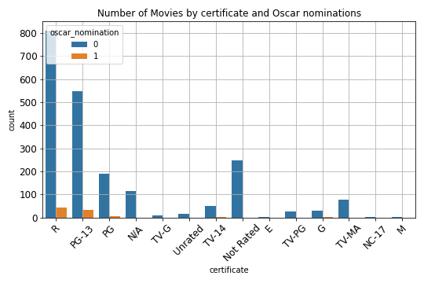

***Fig 13:** Grouped bar chart of films*


### *K.* Line Graphs
Number of ‘R’, ‘PG-13’ and ‘PG’ films produced over the 
period of 10 years (2009 - 2018) were plotted **(Fig 14)** using 
line plot and the following observation was made.
+ From 2009 through 2018, 'R' films dominated the 
film industry.
+ In 2011, the number of 'R' and 'PG-13' films released 
was nearly equal.
+ After 2016, there was a decline in the production of 
films in all three categories.
+ In 2018, the number of 'R' films produced fell below 
that of 'PG-13' films.

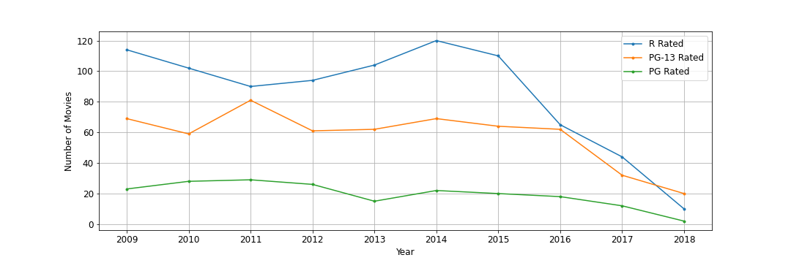
***Fig 14:** Line plot showing total no. of films over 10 years*


To track the overall budget and revenue of the films over 
years, a line plot **(Fig 15)** was created. Following 
observation was made:

+ The revenue line remained consistently large in 
comparison to the budget line, implying that the 
industry is profitable and reliable.
+ Following 2016, there appears to be a drop in both 
budget and revenue.

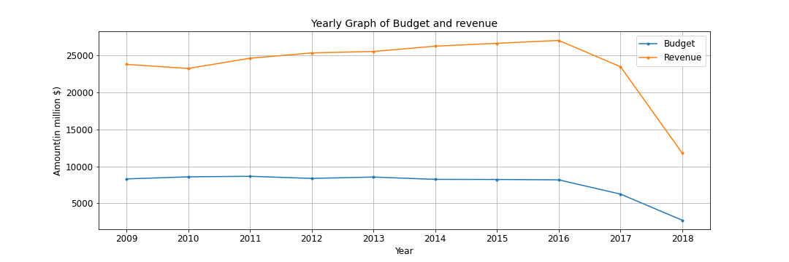
***Fig 15:** Line plot showing total budget and revenue over 10 years*


### *L.* Scatter Plots
Budget vs Award Wins:
+ There is no relationship between a film's budget and 
the number of awards it receives.Scatter Plots for the same belonging to ***"R"*** and ***"PG-13"*** category is displayed in the **Figure 16** below.

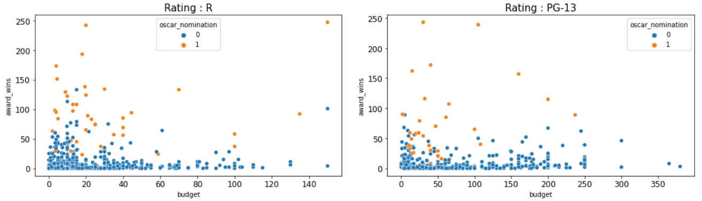
***Fig 16:** Award Win Vs Budget Scatter Plots*

## CONCLUSIONS AND FUTURE WORK

### Conclusions
Following strategies for creating successful movies 
could be offered after comprehensive examination of the 
data:

+ Keep the film’s running time between 1.5 and 2 
hours.
+ There appears to be a positive relationship between 
budget and popularity of the film among audiences. 
Increasing the budget of a film or clever marketing 
might have an impact on its commercial success.
+ Focus more on producing ‘R’, ‘PG-13’ and ‘PG’ 
rated movies.
+ Release films in ‘English’.
+ Incorporate 'Drama' aspects into the film.
+ Associate the film with major production houses.

### Future Work
+ It's reasonable to investigate award winners by genre 
to learn more about which genres are most popular 
with critics and awarding organizations.
+ The number of awards won is a deciding element in 
winning an Oscar. As a result, further research is 
needed to determine the elements that influence the 
number of awards a film receives.
+ More research into the relationship between 
production houses and financial variables needs 
to be done


## References
[1] D. K. Simonton, “Cinematic success criteria and their 
predictors: The art and business of the film industry,” 
Psychol. Mark., vol. 26, no. 5, pp. 400–420, 2009, doi: 
10.1002/mar.20280.

[2] “MovieLens.” https://movielens.org/ (accessed Apr. 28, 
2022).

[3] “The Movie Database API,” API Docs. 
https://developers.themoviedb.org/3/movies/get-movie-details (accessed Apr. 28, 2022).

[4] “Movie Database Alternative API Documentation 
(rapidapi),” RapidAPI. 
https://rapidapi.com/rapidapi/api/movie-database-alternative/ (accessed Apr. 28, 2022).

[5] “Oscars.org | Academy of Motion Picture Arts and 
Sciences,” Oscars.org | Academy of Motion Picture Arts 
and Sciences. https://www.oscars.org/ (accessed Apr. 
28, 2022)
